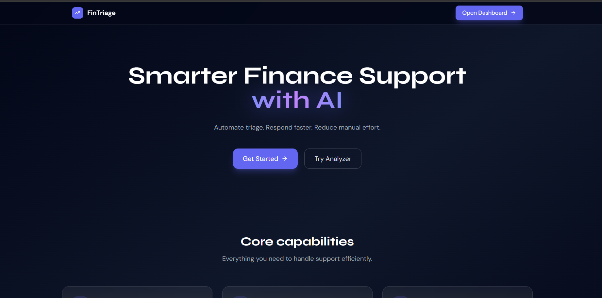
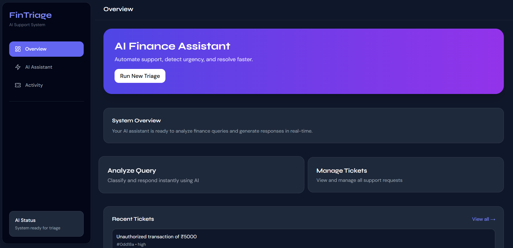
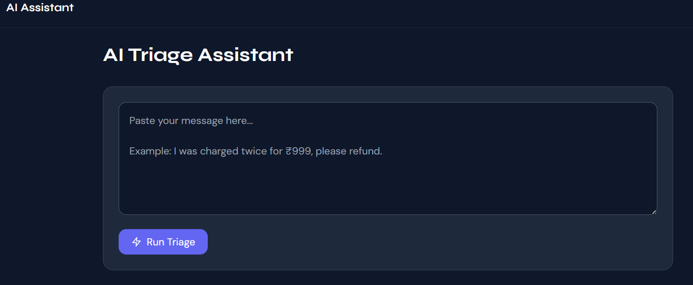
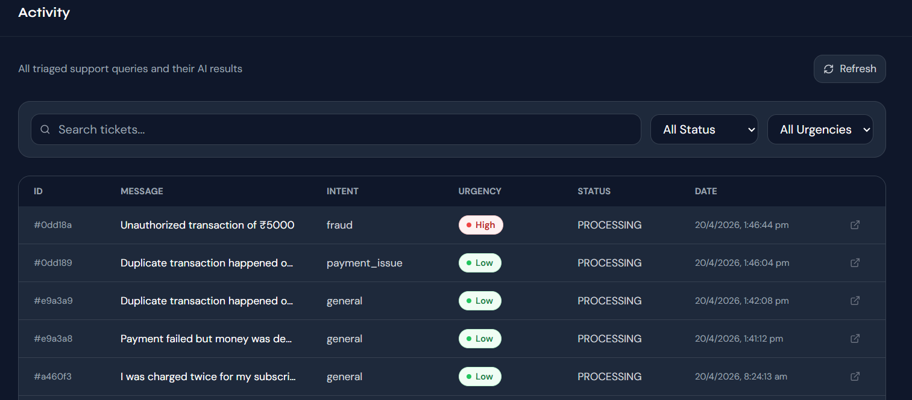

#  Finance Support Triage System

An AI-powered system that automatically analyzes customer finance queries, classifies intent, detects urgency, extracts key details, and generates responses — helping support teams resolve issues faster.

---

##  Features

-  **Intent Classification**
  - Detects query type: fraud, refund, payment_issue, general

-  **Urgency Detection**
  - Categorizes priority: low, medium, high

-  **Entity Extraction**
  - Extracts details like amount, transaction info, etc.

-  **AI Response Generation**
  - Generates professional support replies

-  **Ticket Management Dashboard**
  - View, filter, and manage support tickets

---

##  Tech Stack

### Frontend
- React (Vite)
- Tailwind CSS

### Backend
- FastAPI
- Python

### Database
- MongoDB Atlas

### AI Integration
- OpenRouter (LLM)
- Fallback logic for reliability

---

##  Screenshots

<p align="center">
  
  
</p>

<p align="center">
  
  
</p>

---

##  Setup Instructions

### Frontend Setup
```
cd frontend
npm install
npm run dev
```
### Backend Setup
```
cd app
python -m venv .venv
.venv\Scripts\activate
pip install -r requirements.txt
uvicorn app.main:app --reload
```
